# Medallion Fitness Data Architecture

## Overview

This document outlines the high-level architecture of our data processing system. The system is designed to ingest, process, and analyze data from various sources related to user fitness activities.

## Architecture Diagram

## Components

### Data Sources

- User Registration (Azure SQL): Collects user sign-up information.
- User Profile (CDC): Kafka stream for updates to user profile.
- BPM Stream: Kafka stream for sensed user BPM at regular intervals during workout.
- Workout Session: Kafka stream for user workout session attributes.
- Gym Logins (Azure SQL): Records when users enter and exit gym facilities.

### Landing Zone
This layer serves as the initial storage area for raw data ingested from various sources. It decouples data ingestion from data processing.
- Components:
  - registered_users_raw
  - gym_logins_raw
  - kafka_multiplex_raw

### Bronze Layer
This layer ingests data from the Landing Zone and stores it in Delta tables without significant transformation.
- Tables: 
  - registered_users_bz
  - gym_logins_bz
  - kafka_multiplex_bz

### Silver Layer
Processes and refines data from the Bronze layer, performing operations like data cleansing, transformation, and joining.
- Tables:
  - users: Created from registered_users_bz
  - gym_logs: Created from gym_logins_bz
  - user_profile: Created from kafka_multiplex_bz (filtered for user profile data)
  - workouts: Created from kafka_multiplex_bz (filtered for workout data)
  - heart_rate: Created from kafka_multiplex_bz (filtered for BPM data)
  - user_bins: Created by joining and processing users and user_profile
  - completed_workouts: Created by processing workouts data
  - workout_bpm: Created by joining completed_workouts, users, and heart_rate data

### Gold Layer
Creates aggregated and summarized data for analysis and reporting.
- Tables:
  - workout_bpm_summary
  - gym_summary

## Data Flow

1. Data is ingested from Azure SQL tables and the Kafka multiplex stream into the Landing Zone.
2. Data moves from the Landing Zone to the Bronze layer, where it's stored in structured Delta tables.
3. The Silver layer processes and refines this data:
   - Basic tables (users, gym_logs, user_profile, workouts, heart_rate) are created directly from Bronze layer tables.
   - user_bins is created by combining data from users and user_profile.
   - completed_workouts is derived from the workouts table.
   - workout_bpm is created by joining completed_workouts with users and heart_rate data.
4. The Gold layer aggregates and summarizes the data from the Silver layer for final analysis and reporting.

This architecture follows the medallion architecture pattern, allowing for better data quality, easier debugging, and efficient querying at different stages of data refinement. The use of a Kafka multiplex stream in the Bronze layer allows for efficient handling of multiple real-time data streams, which are then separated and processed in the Silver layer.